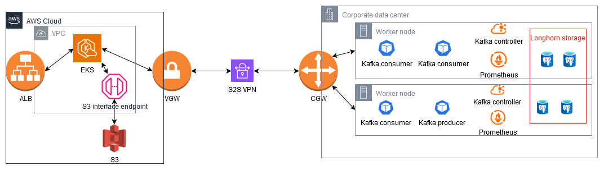
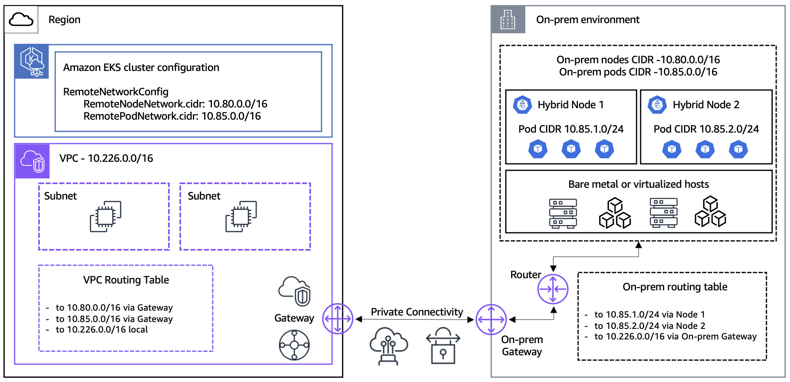
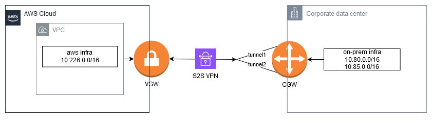
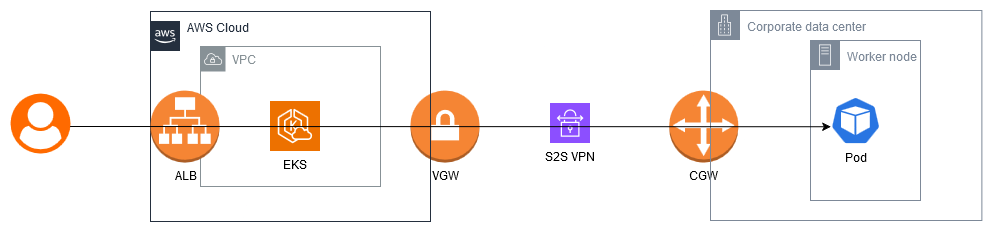
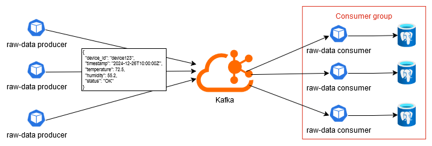
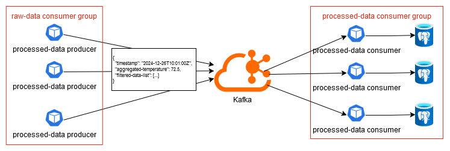
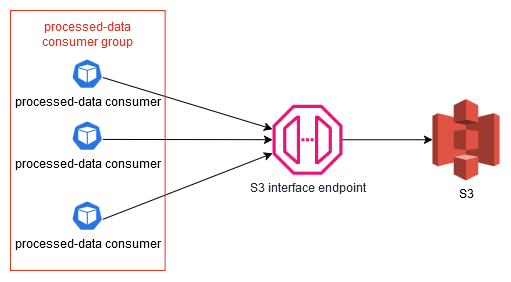

# Project: EKS Hybrid Cluster with Proxmox and Kafka-Based Data Streaming



## Task 1: Configure EKS Hybrid

### 1. Requirements Gathering and Analysis

Objectives: Set up a reliable hybrid Kubernetes cluster with EKS and Proxmox.

Scope:

-   Hybrid Networking: Establish a hybrid network between AWS and the on-premises Proxmox environment
-   Kubernetes Setup:
    -   Deploy an Amazon EKS cluster as the central control plane.
    -   Configure Proxmox edge nodes as hybrid worker nodes in the EKS cluster
    -   Sizing:
        -   **1-2 worker nodes** using large instances (2 vCPU, 4GB RAM) on AWS
        -   **3 worker nodes** on Proxmox



Deliverables:

-   A private connection between the AWS cloud and the on-prem Proxmox cluster.
-   A functional EKS hybrid cluster.

Initial Assessments:

-   The specs require router configuration, however due to being unable to configure on-prem router remotely we will omit this step. We will proceed under the assumption that the private connection will be successfully established.
-   Consider using 3rd SD-WAN solutions (eg Cisco Viptela) if there's a need to scale to multiple sites in the future. However be aware of the significant upfront costs.
-   EKS Auto Mode: AWS recently released EKS Auto Mode (30 days ago as of the time of writing), this mode could simplify automation and we will explore its potential use. However, EKS Auto Mode _does not_ support deploying or managing EC2 instances, the virtual machines are managed us with our choice of tooling [https://docs.aws.amazon.com/eks/latest/userguide/eks-compute.html](https://docs.aws.amazon.com/eks/latest/userguide/eks-compute.html).

### 2. Design

This task can be divided into 2 main subtasks:

1. Establishing a Site-to-Site VPN Connection: Configure a secure connection between the on-prem environment and AWS.
2. Setting up the Hybrid EKS Cluster: Deploy the EKS cluster and integrate the on-prem worker nodes.

#### Site-to-Site VPN

We can simplify the original network diagram to the following:



The following checklist outlines the steps to establish the connection:

1. Create Virtual Private Gateway.
2. Attach VPG to VPC.
3. Create Customer Gateway, ensure a static public IP is available for the on-prem router.
4. Create VPN Connection between the VPG and CGW. For this proof of concept, we will use static routing and allow AWS to auto-generate tunnel credentials.
5. Configure the IKE VPN connection on the on-prem router.
6. After completing these steps there should be two IPSec tunnels between the on-prem environment and AWS, one active and one on standby.

Refers to [https://docs.aws.amazon.com/vpn/latest/s2svpn/SetUpVPNConnections.html](https://docs.aws.amazon.com/vpn/latest/s2svpn/SetUpVPNConnections.html) for details.

#### EKS Hybrid Cluster

The following checklist outlines the steps to set up the EKS Auto Mode cluster:

1. Configure EKS Auto Mode on the AWS side. This will generate an SSM configuration file for worker node authentication.
2. On each worker node:

-   Disable swap abd configure a static IP address.
-   Disable SELinux or AppArmor if they are enabled.
-   Install the necessary AWS tools: AWS CLI, SSM Agent and nodeadm.
-   Run nodeadm commands using the SSM configuration file generated in step 1 to register the node with the EKS cluster.

3. Choose a supported CNI, we will use Calico. See supported versions: [https://docs.aws.amazon.com/eks/latest/userguide/hybrid-nodes-cni.html](https://docs.aws.amazon.com/eks/latest/userguide/hybrid-nodes-cni.html).
4. Install ALB IngressClass, then we can deploy a Ingress to enable external access to pods running on the worker nodes via the ALB.



### 3. Implementation

The implementation details are located in the `infrastructure` folder.

1. `boostrapper`:

-   Since we're starting from scratch, we'll need to initially provision an S3 bucket for storing Terraform state and a DynamoDB table for state locking.

2. `s2s-vpn` - Configure VPC and Site-to-Site VPN:

-   Use the `vpc` and `vpn-gateway` modules to deploy the infra with static routing.

3. Configure Customer Gateway:

-   Configure the IPsec connections on the on-prem router, the specific steps will vary depending on the router model. Use the outputs from `s2s-vpn` for configuration.

4. Validate VPN Connection:

-   Verify the VPN connection using the following commands ([https://www.trendmicro.com/cloudoneconformity/knowledge-base/aws/VPC/vpn-tunnel-up.html](https://www.trendmicro.com/cloudoneconformity/knowledge-base/aws/VPC/vpn-tunnel-up.html)):

```bash
aws ec2 describe-vpn-connections --filters "Name=state,Values=available" --query 'VpnConnections[*].VpnConnectionId'
aws ec2 describe-vpn-connections --vpn-connection-ids <vpn-id> --query 'VpnConnections[*].VgwTelemetry[*].Status[]'
```

5. `eks-hyrid` - Configure EKS Cluster (Auto Mode):

-   Use the `eks` module. In the `cluster_compute_config` section, set `node_pools` to `general-purpose` to configure the cluster in Auto Mode.
-   Obtain the `kubeconfig` file using:

```bash
aws eks update-kubeconfig --name <cluster-name>
```

6. Configure Worker Nodes:

-   Install the hybrid node version of `nodeadm` on each worker node ([https://docs.aws.amazon.com/eks/latest/userguide/hybrid-nodes-nodeadm.html](https://docs.aws.amazon.com/eks/latest/userguide/hybrid-nodes-nodeadm.html)).
-   EC2 worker nodes running Amazon Linux have their own version of [`nodeadm`](https://awslabs.github.io/amazon-eks-ami/nodeadm/), use this specific version for configuration instead of the one intended for hybrid nodes.
-   Run the following commands to register the node with the EKS cluster:

```bash
nodeadm install <eks-version> --credential-provider ssm
nodeadm init --config-source file://<path-to-nodeConfig.yaml>
```

7. Validate Worker Nodes:

```bash
nodeadm debug --config-source file://<path-to-nodeConfig.yaml>
```

8. `eks-hybrid-cni` - Configure Calico and ALB:

-   Deploy Calico as the CNI and then install the ALB IngressClass.

### 4. Testing and Maintenance

Deploy `tests/eks-app.yaml`, the web application should be accessible from the internet.

Refer to the [official documentation](https://docs.aws.amazon.com/eks/latest/userguide/hybrid-nodes-troubleshooting.html) for troubleshooting hybrid nodes.

## Task 2: Monitoring Setup

### 1. Requirements Gathering and Analysis

Objectives: Monitor the 4 golden signals (latency, traffic, errors, and saturation).

Scope:

-   Deploy **Prometheus and Grafana** for cluster monitoring.
-   Create dashboards for the **4 Golden Signals**:
    -   **Latency**: Monitor API server request latency and Kafka consumer/producer response times.
    -   **Traffic**: Track requests per second (Kafka topic throughput).
    -   **Errors**: Measure pod crash loops, failed consumer retries, and dropped Kafka messages.
    -   **Saturation**: Monitor CPU, memory, and disk I/O usage on both cloud and edge nodes.

Deliverables:

-   Prometheus and Grafana services on EKS cluster.
-   Create dashboards to monitor the latency, traffic, errors and saturation of the specified services.

Initial Assessments:

-   To monitor API server and node metrics, an [AWS article](https://aws.amazon.com/blogs/containers/troubleshooting-amazon-eks-api-servers-with-prometheus/) recommends using the [API troubleshooter dashboard](https://github.com/RiskyAdventure/Troubleshooting-Dashboards). Additionally [Golden Signals dashboard](https://grafana.com/grafana/dashboards/21073-monitoring-golden-signals/) is also available on Grafana Labs. We will evaluate both options.

### 2. Design

-   Prometheus Installation: There are multiple Prometheus stacks to choose from, [AWS documentation](https://docs.aws.amazon.com/eks/latest/best-practices/kubernetes_upstream_slos.html) suggests using the `kube-prometheus-stack` for collecting Kubernetes metrics.
-   Dashboard configuration: We will deploy both dashboards mentioned above and later select the one that best fits our requirements.
-   Kafka configuration: We will install Kafka using the Bitnami Helm chart (detailed in a later task), this chart includes `jmx_exporter`. For additional metrics collection, we can install the [`kafka_exporter`](https://github.com/danielqsj/kafka_exporter) which also provides a [Grafana dashboard](https://grafana.com/grafana/dashboards/7589-kafka-exporter-overview/).

### 3. Implementation

The implementation details are located in the `infrastructure` folder.

1. `monitoring` - Install Prometheus:

-   Add `eks.amazonaws.com/compute-type: hybrid` to ensure services are deployed on worker nodes.
-   Disable scraping for `kube-scheduler` and `kube-controller-manager` as they are managed by AWS.

2. `monitoring-dashboards` - Configure dashboards:

Based on [AWS Observability Documentation](https://aws-observability.github.io/observability-best-practices/guides/containers/oss/eks/best-practices-metrics-collection):

-   Use `apiserver_request_duration_seconds` to track API server request latency.
    -   monitoring-golden-signals/21073_rev1.json provides: API server Request duration 99th quantile (line 5624).
    -   Troubleshooting-Dashboards/api-troubleshooter.json: Core API Request Duration Heatmap (line 460) and Slowest Requests (P90) - 5min (line 653).
-   Use `node_cpu_seconds_total` and `node_memory_MemAvailable_bytes` to track CPU and memory utilization.
    -   monitoring-golden-signals/21073_rev1.json: Cluster CPU utilization (line 1540), Cluster Memory Utilization (line 1614), Nodes with highest CPU utilization (line 2080) and Nodes with highest Memory utilization (line 2174).
    -   Troubleshooting-Dashboards/api-troubleshooter.json: Current Utilization (line 147).
-   Use `node_disk_read_bytes_total`, `node_disk_written_bytes_total`, and `node_filesystem_avail_bytes` to monitor disk I/O usage.
    -   _Note:_ A persistent storage service (eg [Longhorn](https://longhorn.io/)) can provide additional storage-related metrics.
-   Use `kube_pod_container_status_restarts_total` to track pod crash loops.
-   To track Kafka topic throughput:
    -   kafka_exporter/7589_rev5.json: Message in per second (line 105 and line 282).
-   To track Kafka consumer/producer response times:
    -   kafka_exporter/7589_rev5.json: Lag by Consumer Group (line 195).
-   The Terraform project will deploy 3 dashboards.
-   (Optional) While the task does not require configuring alerts, it's worth noting there's a [collection](https://github.com/samber/awesome-prometheus-alerts) of Prometheus alerting rules we can use:

    1. [Kubernetes API server latency](https://samber.github.io/awesome-prometheus-alerts/rules#rule-kubernetes-1-35)
    2. [Host high CPU load](https://samber.github.io/awesome-prometheus-alerts/rules#rule-host-and-hardware-1-15)
    3. [Host out of memory](https://samber.github.io/awesome-prometheus-alerts/rules#rule-host-and-hardware-1-1)
    4. [Host memory under memory pressure (page faults)](https://samber.github.io/awesome-prometheus-alerts/rules#rule-host-and-hardware-1-2)
    5. [Host unusual disk read rate](https://samber.github.io/awesome-prometheus-alerts/rules#rule-host-and-hardware-1-6)
    6. [Host unusual disk write rate](https://samber.github.io/awesome-prometheus-alerts/rules#rule-host-and-hardware-1-7)
    7. [Host out of disk space](https://samber.github.io/awesome-prometheus-alerts/rules#rule-host-and-hardware-1-8)
    8. [Host disk will fill in 24 hours](https://samber.github.io/awesome-prometheus-alerts/rules#rule-host-and-hardware-1-9)

## Task 3: Deploy Kafka-Based Data Streaming

### 1. Requirements Gathering and Analysis

Objectives: Deploy and operate a Kafka-based real-time data streaming pipeline on edge nodes.

Scope:

1. **Kafka Broker Setup:**

-   Deploy a Kafka broker (e.g., Redpanda or Apache Kafka) on the Proxmox edge nodes.
-   Configure topics:
    -   `raw-data`: For incoming IoT telemetry.
    -   `processed-data`: For aggregated and filtered data.

2. **Simulate Data Producers:**

-   Deploy a Python or Node.js script to simulate IoT devices publishing telemetry data to the `raw-data` topic.
-   Data schema:

```json
{
    "device_id": "device123",
    "timestamp": "2024-12-26T10:00:00Z",
    "temperature": 72.5,
    "humidity": 55.2,
    "status": "OK"
}
```

-   Publish ~100 messages/second.

3. **Stream Processing:**

-   Deploy Apache Flink or a Python consumer to process the `raw-data` topic:
    -   Aggregate temperature data (average per minute).
    -   Filter out data where `status != "OK"` or `temperature > 100°C`.
-   Publish results to the `processed-data` topic.

4. **Cloud Integration:**

-   Configure Kafka Connect or a custom consumer to forward `processed-data` to Amazon S3 as hourly Parquet files.

Deliverables:

-   Kafka services on EKS cluster.
-   Producer and consumer applications for task handling.
-   An S3 interface endpoint for sending Parquet files to.

Initial Assessments:

-   S3 Endpoint Type: S3 Gateway endpoints are incompatible with on-prem access, therefore an interface endpoint is required. (see: [https://docs.aws.amazon.com/AmazonS3/latest/userguide/privatelink-interface-endpoints.html#types-of-vpc-endpoints-for-s3](https://docs.aws.amazon.com/AmazonS3/latest/userguide/privatelink-interface-endpoints.html#types-of-vpc-endpoints-for-s3))
-   Kafka monitoring: The Kafka cluster should be configured for automatic metric scraping by Prometheus, fulfilling the monitoring requirement in Task 2.
-   Stream processing: [MassTransit](https://masstransit.io/) can be utilized for stream processing, although primarily designed for message brokers it also offers limited support for event streaming technologies like Kafka. [Redpanda](https://www.redpanda.com/blog/kubernetes-go-data-pipeline) was considered as an alternative, however MassTransit also offers capabilities relevant to Task 4, discussed later in this report.

### 2. Design

This task can be divided into 7 main subtasks:

1. S3 interface endpoint installation: Both EKS hybrid mode and PrivateLink lack IPv6 support (see: [https://docs.aws.amazon.com/eks/latest/userguide/hybrid-nodes-cluster-create.html](https://docs.aws.amazon.com/eks/latest/userguide/hybrid-nodes-cluster-create.html) and [https://docs.aws.amazon.com/AmazonS3/latest/userguide/privatelink-interface-endpoints.html#private-dns](https://docs.aws.amazon.com/AmazonS3/latest/userguide/privatelink-interface-endpoints.html#private-dns)), the endpoint must be configured to support IPv4 exclusively.

2. Persistent storage for EKS Hybrid: A storage provisioner is needed for the on-prem environment. [Longhorn](https://longhorn.io/), a distributed block storage, is a suitable choice due to its ease of setup and use compared to matured alternatives like Ceph, while still meeting the project's short timeframe.

3. Kafka installation: The well-tested and popular [Bitnami Kafka chart](https://github.com/bitnami/charts/tree/main/bitnami/kafka) can be used for installation.

4. Stream processing with MassTransit (MT):

The workflow using MT is straightforward: 1. Produce `raw-data` -> 2. Consume `raw-data` -> 3. Perform ETL -> 4. Produce `processed-data` -> 5. Perform ETL -> 6. Push report files to S3. However, there are caveats to consider when using MT:

Cons of using MT:

-   Lack of Kafka Streams Support: The task is ideally suited for Kafka Streams due to its native aggregation capabilities. Unfortunately, MT lacks support for Kafka Streams despite having its own [saga](https://masstransit.io/documentation/patterns/saga) state machine implementation that could theoretically replicate some Kafka Streams functionality.
-   Design Mismatch: MT is designed for publish-subscribe patterns with competing consumers, common in message brokers. On the other hand, Kafka is an event streaming platform and does not even support competing consumers. This will lead to a less-than-ideal "hacky" implementation.

Justification for using MT:

-   Initially, MT was chosen under the assumption that its Saga implementation could support streaming use cases. This proved **incorrect**. However, due to significant prior investment in MT and time constraints the project will continue with MT. We acknowledge the limitations and will employ additional mitigation technologies to compensate and achieve the objectives.
-   Mitigation: a temporary data store will be introduced before writing Parquet files to S3. Task 4 requires the telemetry data to have durability, PostgreSQL will be used for temporary state storage. PostgreSQL's `jsonb` type offers support for document-oriented data making it suitable for this use case.

Pros of using MT:

-   Built-in resilience: MT provides native support for resilience.
-   Monitoring and tracing: MT supports OpenTelemetry for logging, monitoring and tracing.

These pros align with the requirements of Task 4.

5. Create S3 Parquet bucket.

6. Uploading Parquet files to S3:

-   As per the [documentation](https://docs.aws.amazon.com/AmazonS3/latest/userguide/privatelink-interface-endpoints.html), access to S3 requires explicit URL endpoints, eg `https://bucket.<vpce-1a2b3c4d-5e6f>.s3.<region>.vpce.amazonaws.com`.
-   Parquet schema details:
    -   Aggregated temperature files:
        -   `Timestamp`
        -   `Temperature`
    -   Filtered data Files:
        -   `DeviceId`
        -   `Timestamp`
        -   `Temperature`
        -   `Humidity`
        -   `Status`
-   S3 Key Structure: Files will be uploaded to S3 using the following key format: `<year>/<month>/<day>/filename_<timestamp>.parquet`.

7. Container image and Helm chart building:

-   Applications should support OTLP for exporting metrics to Prometheus and Jaeger, as required by Task 4.
-   GitHub Actions can be employed to automate the build processes.

### 3. Implementation

The implementation details are located in the `infrastructure`, `manifests`, `.github/workflows`, and `KafkaExample.*` folders.

1. S3 interface endpoint: This is included in the previously mentioned `s2s-vpn` project. The URL endpoint can be extracted from the project outputs.

2. `eks-storage` - Configure Longhorn for Persistent storage:

-   Access the web UI to configure which disks will be used for Kubernetes volumes. Refer to the documentation: [https://longhorn.io/docs/1.7.2/deploy/accessing-the-ui/](https://longhorn.io/docs/1.7.2/deploy/accessing-the-ui/).

3. `producer-consumer` - Configuring Kafka and Producer/Consumer applications:

-   Kafka:
    -   To fulfill task 3, enable metric exporting via `jmx_exporter`.
    -   Provision the `raw-data` and `processed-data` topics as per the task requirements. Since the task doesn't specify the number of partitions, we will create 3 for each topic.
    -   To meet the data specification requirements, configure MT's naming convention to use kebab-case.
-   `KafkaExample.RawDataProducer` - `raw-data` producer: To simulate high loads, increase the replica count and decrease the sleep time between each `raw-data` production event.
-   `KafkaExample.RawDataConsumer` - Each topic partition will be assigned a dedicated consumer, each consumer will have its own database to avoid read/write bottlenecks. After processing ETL and producing `processed-data`, temporary data will be cleared.
-   `KafkaExample.ProcessedDataConsumer` - `process-data` producer and haling S3 Parquet file handler: Similar to `RawDataConsumer`, each topic partition will be assigned a dedicated consumer, and the database will be configured similarly to prevent bottlenecks. Temporary data will be deleted only after S3 Parquet files are successfully uploaded, this ensures data will be correctly forwarded to S3 upon reconnection in case of a network failure, as described in Task 4.

-   OpenTelemetry: To enable tracing and metric exporting with OTLP, configure the relevant settings in the Helm chart value files.

4. Github Action workflows: Workflows are provided to automate image builds and Helm chart builds.

How it works:

-   Step 1: `raw-data` producers generate arbitrary random data and publish it to a Kafka topic. `raw-data` consumers, running in a competing consumer model, immediately pull this data. The data is processed and temporarily stored in a PostgreSQL database.



-   Step 2: The `raw-data` consumer aggregates temperature data, filters it, and publishes the results to the `processed-data` topic every 60 seconds.



-   Step 3: The `processed-data` consumer creates Parquet files from the data and uploads them to S3 via an interface endpoint every hour.



### 4. Testing and Maintenance

-   Adjust the number of replicas and sleep time for the `raw-data` producers to scale the stream input up or down. While the Task 4 test environment only needs to support approximately 500 messages per second, MT is designed to handle significantly more. MT developers [report](https://youtu.be/CJ_srcJiIKs?t=1036) that MT can support up to 50000 messages per second in their testing, suggesting our current code should scale effectively.
-   Maintenance is streamlined due to the use of workflows, the runners automatically build the latest images and charts, minimizing manual intervention.

## Task 4: Resilience and Scalability Testing

### 1. Requirements Gathering and Analysis

Scope:

1. **Simulate Load:**

-   Increase data producer rate to ~500 messages/second for 10 minutes.
-   Monitor Kafka’s throughput, consumer lag, and resource usage.

2. **Simulate Network Failure:**

-   Temporarily disconnect the edge nodes from AWS.
-   Validate that:
    -   The Kafka broker buffers data during disconnection.
    -   Data is forwarded correctly to S3 upon reconnection.

3. **Horizontal Scaling:**

-   Configure KEDA to scale Kafka consumers based on the lag in the raw-data
    topic.
-   Validate automatic scaling of edge nodes when message rates exceed 400
    messages/second.

Initial Assessments:

-   Due to time constraints, the KEDA portion will be skipped.

### 2. Design and Implementation

-   Load simulation:
    -   To achieve a data producer rate of approximately 500 messages/second, the `raw-kproducer` replica count can be increased to 50, and the sleep time between production events can be reduced to 100ms.
    -   The Kafka cluster along with all Kafka consumers and producers are pre-configured for automatic metrics scraping by Prometheus. No further action is required.
-   Network failure simulation:
    -   Kafka broker buffering: The current architecture utilizes competing consumer model, making disconnections between Kafka and consumers inconsequential. Each consumer has its own datastore (utilizing Longhorn for data replication) to ensure high data durability and prevent data loss.
    -   S3 data reforwarding: In the event of network loss, the applications are configured to handle retries. Data persistence is ensured by an ACID-compliant database cluster, the application only deletes temporary data after successfully forwarding the Parquet files to S3.
